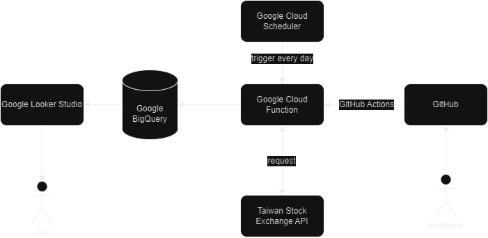

# Stock Homework

This is a program that can crawl the daily closing prices of Taiwan's stock market.

[Data Visualization](https://lookerstudio.google.com/reporting/d8ae56c6-0eee-4224-80a5-5f97450f74c2)

Data Source: [台灣證券交易所 OpenAPI](https://openapi.twse.com.tw/)

## System Architecture


## Environments

developed under Python 3.9.10.

## Installing

Here are two methods to deploy this program:

1. Run it on your own machine.
2. Use Google Cloud Function.


first clone this repository.

```
$ git clone https://github.com/Chendada-8474/stock-homework.git
```
start up a Google BigQuery service

Create a table with four columns.

| column name  | type   |
| ------------ | ------ |
| Code         | STRING |
| Name         | STRING |
| ClosingPrice | FLOAT  |
| ClosingDate  | DATE   |

### On your own machine

install packages
```
$ pip3 install -r requirements.txt
```

#### 1. download GCP API key

[download page](https://console.cloud.google.com/apis/credentials/serviceaccountkey?_ga=2.208590738.-121430735.1530179569)

Place the downloaded JSON file in the project's directory.

#### 2. set config.yaml

```yaml
target_stocks: ["<company stock code>", "<company stock code>"]  # ex: ["0050", "2330"]
gcp_auth_json: "<file name of your gcp api key>.json"
table_name: "<your gcp project name>.<your bigquery dataset name>.<your table name>"
```

#### 3. run

Execute `main.py` to fetch the stock market data for the previous business day.

If you are using the Windows operating system, you can use the Task Scheduler to schedule the program to run periodically. For Linux, you can use crontab to help automate the execution of the tasks.


### Google Cloud Function and Cloud Scheduler

First, set config.yaml.

```yaml
target_stocks: ["<company stock code>", "<company stock code>"]  # ex: ["0050", "2330"]
table_name: "<your gcp project name>.<your bigquery dataset name>.<your table name>"
```

#### setting references

- [You may need to setup the GCP Workload Identity for authorizing GitHub](https://www.youtube.com/watch?v=l-nws1e4B8M)
- [Deploy Cloud Function by GitHub Actions](https://github.com/google-github-actions/deploy-cloud-functions)
- [Clund Scheduler is a good tool for scheduling your Clund Function](https://cloud.google.com/scheduler/docs/schedule-run-cron-job)